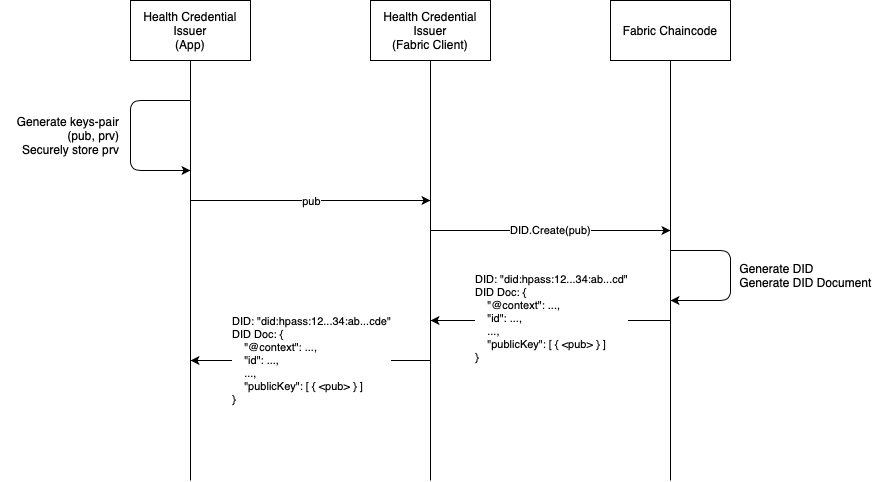
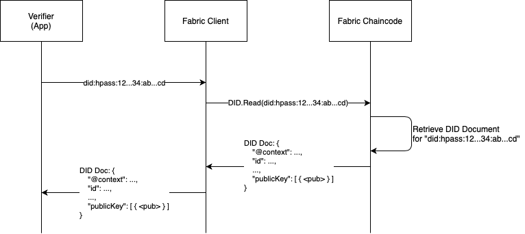
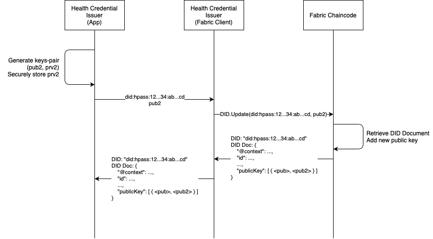
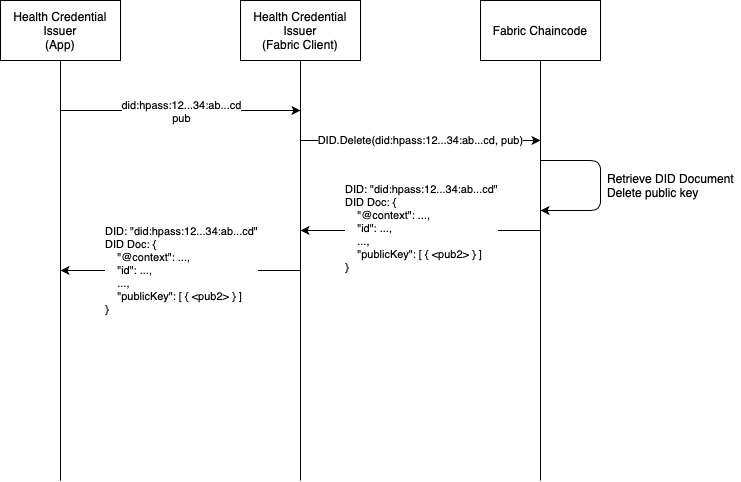

# IBM Digital Health Pass DID method (_hpass_)

This document is licensed under  a [Creative Commons Attribution 4.0 International License](https://creativecommons.org/licenses/by/4.0/)

## ToC

* [Introduction](#introduction)
* [DIDs](#dids)
  - [DID Syntax](#did-syntax)
  - [DID Documents](#did-documents)
  - [CRUD Operations](#crud-operations)
  - [Security Considerations](#security-considerations)
  - [Privacy Considerations](#privacy-considerations)

## Introduction

[IBM Digital Health Pass](https://www.ibm.com/products/digital-health-pass), 
part of IBM Watson Works, is a solution that allows people to attest their 
health status against any potential verifier, such as employers, event
organizers, etc.

In order to foster deployability and compatibility with existing technologies,
IBM Digital Health Pass relies on current standards and specifications as much as
possible. In the context of digital identities, W3C's Standards for 
Decentralized IDentities ([DIDs](https://www.w3.org/TR/did-core/)) and 
Verifiable Credentials ([VCs](https://www.w3.org/TR/vc-data-model/)) are rapidly
gaining traction, especially in blockchain-related domains.

In the following, we describe how the DID specification fits our setting.
The Health Pass setting builds on an [Hyperledger 
Fabric](https://www.hyperledger.org/use/fabric) blockchain system. The following
entities are involved in the system:

- **Health Authorities**. Authorities that control the network. They can be
  Health Ministries, local branches of national governments, etc. for use
  cases aimed at the general public; but also companies and testing centers
  for scenarios aimed at private use of the system. Health Authorities own the 
  network, issue certificates for Health Credential Issuers, and publish schemas
  that the latter need to follow in order to issue health credentials for end 
  users.
- **Health Credential Issuers**. Test Centers, Hospitals, etc. They join the
  network after approval by the Health Authorities. They have Fabric clients 
  with valid Fabric identities that they use to interact with the network, and
  from which their DIDs are derived. They can associate new keypairs to their
  DID, that they will use to issue health credentials to end users.
- **Credential Holders**. Citizens, employees, etc. They receive credentials by 
  Health Credential Issuers. They will receive health credentials from Health 
  Credential Issuers. Note that end users do not receive DIDs, but we mention 
  them here to provide a complete picture.
- **Verifiers**. Companies, businesses, public transportation systems, etc.
  that need to verify the health status of Credential Holders.

Concerning their role in the blockchain system _per se_, Health Authorities
are expected to run (orderers and) peers, Health Certificate Issuers need to 
have clients, and End Users are completely agnostic.

## DIDs

DIDs are used to manage Health Authorities' cryptographic material. In a 
nutshell, Health Pass keeps track of the public keys of Health Authorities
via DIDs. First, a Health Authority needs to be onboarded, meaning that it
will have a Fabric identity issued from a valid Membership Service Provider
(MSP). Then, with this Fabric identity, the Health Authority can trigger the
creation of a DID. The controller of the DID will be the actual Health 
Authority. 

Besides the usual DID methods, which are integrated within the
Fabric ecosystem, and thus leverage some of its features, Health Pass also
defines a DID Syntax with specific rules. The following sections expand on
this introductory note.

### DID Syntax

Decentralized IDentifiers are required to be strings that allow uniquely 
identifying the entity they represent. For this purpose, a syntax in 
[ABNF grammar](https://en.wikipedia.org/wiki/Augmented_Backus–Naur_form) is 
usually defined. In our case, this grammar is as follows:

```
did        = "did:hpass:" genesishash ":" identifier
genesishash      = 64(hexdigit)
identifier = 64(hexdigit)
hexdigit     = "0" / "1" / "2" / "3" / "4" / "5" / "6" / "7" / "8" / "9" / "a" / "b" / "c"
    / "d" / "e" / "f"
```

Where `did` and `hpass` are literals that define our Health Pass namespace.
`genesishash` is a string containing the (hex-encoded SHA256) hash of the 
genesis block pertaining to the Fabric network where the DID was created. Its 
purpose is to prevent "migration" of DIDs (we expand on this in the 
[Security Considerations](#security-considerations) section). The
`identifier` field allows to uniquely identify the DID owner. In Health Pass, 
this identifier is computed as the (hex-encoded) SHA256 hash of the MSP 
identifier and the Fabric identity of the DID owner. Including the MSP 
identifier is yet an extra mechanism to prevent ambiguous DIDs, or malicious
actors transferring the DID to another network. 

Alternatively, the previous regular expression can be defined in POSIX BRE 
format as follows:

```
"^did:hpass:[0-9a-f]{64}:[0-9a-f]{64}"
```

### DID Documents

Every DID has an associated DID document, which contains the necessary 
information to cryptographically verify the validity of the entity it makes
reference to, or operations performed by this entity.

DID documents are [JSON-LD](https://json-ld.org) objects with the following 
structure (the hex-encoded hashes are trimmed for the sake of presentation):

```
{
    "@context": "https://www.w3.org/ns/did/v1",
    "created": "2020-11-04T16:00:51Z",
    "id": "did:hpass:dc83e354...8c1ed35a:0773762b...d488c861",
    "publicKey": [
        {
            "controller": "did:hpass:dc83e354...8c1ed35a:0773762b...d488c861",
            "id": "did:hpass:dc83e354...8c1ed35a:0773762b...d488c861#key-1",
            "publicKeyJwk": {
                "crv": "P-256",
                "kty": "EC",
                "x": "81iuFbmXKVxy1D8DTUjVpRhaLCXcuP4KKcmYXz2o760",
                "y": "P3wfEzeFYBPazUp0rd0dy3pXW_Sriz5W_IIKCIDnkeA"
            },
            "type": "JsonWebKey2020"
        }
    ],
    "updated": "2020-11-04T16:00:51Z"
}
```

All fields are self-explanatory and as defined in the 
[DID definition](https://www.w3.org/ns/did/v1). Note that we do not explicitly
specify a `controller` object for the DID document (`controller` is an optional
field there). As will become aparent in the definition of the CRUD methods, only
the owner of the Fabric identity from which the DID was derived, can make changes
to the DID document (and this is enforced by the underlying Fabric blockchain). 
Therefore, this is the same entity as the one represented by the DID, and adding
a `controller` field would be redundant.

To specify the value of a `publicKey`, we use the `publicKeyJwk` inner object.
We use ECDSA with the Secp256r1 curve, for which the DID specifications advise 
using either _JWK_ format or _Base58_ format to encode public keys. We choose 
_JWK_ format given its wide codebase in multiple languages.

Finally, public keys have their own DID, specified via DID fragments. This is 
because one DID may have multiple associated public keys. The `#key-N` suffix 
allows identifying different keys related to the same entity.

### CRUD Operations

DIDs can be managed through a chaincode in Hyperledger Fabric that implements
the typical CRUD methods. In what follows, we assume that a Health Credential
Issuer has been approved to join the system, has obtained a Hyperledger Fabric
client identity (X.509 certificate), and is running a Fabric Client.

#### Create

* _Input_: An ECDSA public key.
* _Output_: The produced DID document.
* _Requirements_: The transaction needs to originate from a Fabric Client owned
by a Health Credential Issuer.

The Health Credential Issuer uses its Fabric client to execute the DID Create 
Method of the chaincode managing DIDs. The chaincode that manages the request
fetches the Fabric identity and MSP identifier from the X.509 certificate of the
caller, and uses them to derive the DID as described in the [DID Syntax 
Section](#did-syntax). The additional ECDSA public key given as input parameter
is added to the `publicKey` array included in the new DID document.

The produced DID document will have the structure defined in the [DID Document
Section](#did-document), where the genesis block hash is taken from the network
information, and the MSP identifier and Fabric identity are taken from the
transaction caller.

For illustration purposes, we sketch next a flow of the described process.

<!-- .element height="75%" width="75%" -->

#### Read

* _Input_: The DID.
* _Output_: The associated DID document.

Any entity with access to the Fabric network can query DID documents by their
associated DID. The DID document is fetched directly from the Fabric network
that stores it. Therefore, its authenticity is derived from the properties of 
the blockchain system. 

For illustration purposes, we sketch next a flow of the described process. Note
that the entity requesting access to the DID document is described as a verifier,
but this does not need to be the case.

<!-- .element height="75%" width="75%" -->

#### Update

* _Input_: The certificate associated to the new public key to be added to the 
caller's DID.
* _Output_: The DID document that was updated.
* _Requirements_: The transaction needs to originate from a Fabric Client owned
by the Health Credential Issuer and authenticated with the Fabric identity used
in [Create](#create).

The DID will be extracted from the certificate associated to the chaincode 
request, and therefore the call needs to originate (and, specifically, be 
signed) by the Fabric client specified as controller of the DID that will be 
updated.

The received key is added to the keys that were already associated to the given
DID. If the last key added to the DID had index `N`, the new key will receive
index `N+1`.

For illustration purposes, we sketch next a flow of the described process.

<!-- .element height="75%" width="75%" -->

#### Delete / Deactivate

* _Input_: The certificate associated to the public key to be deleted from the
caller's DID.
* _Output_: The DID document from which the public key was deleted.
* _Requirements_: The transaction needs to originate from a Fabric Client owned
by the Health Credential Issuer and authenticated with the Fabric identity used
in [Create](#create).

The DID will be extracted from the certificate associated to the chaincode 
request, and therefore the call needs to originate (and, specifically, be 
signed) by the Fabric client specified as controller of the DID that will be 
updated.

The given public key is removed from the set of public keys associated to the
specified DID.

For illustration purposes, we sketch next a flow of the described process.

<!-- .element height="75%" width="75%" -->


### Security Considerations

As opposed to public blockchain networks, multiple Fabric networks may coexist.
Also, nothing prevents (and it may actually be desirable) that multiple 
instances of a Health Pass solution live in different networks. Since they would
most probably be based on compatible instantiations, the question arises about
whether DIDs from one network could be used in another network. While this may
be desirable in general, as it fosters interoperability, it may also lead to 
attacks unless mechanisms are incorporated that allow detecting unwanted
"migrations". In order to uniquely identify the origin of a DID, we incorporate 
into the DID Syntax the following data:

- `genesishash`: This corresponds to the SHA256 hash of the genesis block of the
network in which the DID was generated. This hash is (with overwhelming 
probability) unique across networks.
- MSP identifier: The identifier of the Membership Service Provider that issued
the Fabric identity that the DID owner used to request the creation of its DID.
This value is required to be unique per Fabric network.
- Fabric identity: The identifier of the X509 certificate issued by the MSP
to the requester of the DID. Note that, as explained above, DID Owners (Health
Authorities) need to first join the Fabric network in order to get a DID.

Altogether, the full string uniquely identifies any entity with a Fabric 
identity (across Fabric networks). While all the values are not explicit in the
DID (MSP and Fabric identifiers are hashed), the actual DID is deterministically
derived from them. Specifically (as long as the hashing algorithm is secure), no
other combination of genesis block hash, MSP identifier and Fabric identity can 
lead to the same DID.

### Privacy Considerations

DID documents in the hpass method do not include any PII, as required by the DID core specification, and recommended for privacy reasons.

We note that the entities that receive DIDs in IBM Digital Health Pass are Health Credential Issuers, which are public (or publicly known) entities. The only information related to these entities that is written into the DID Documents, and accessible directly from the Hyperledger Fabric network, is their public key, which by definition poses no privacy risk on its own.
 
In particular, no information related to end users or their credentials is written into the DID Documents.

Shall any extra information be needed to be made available through the DID Document of a Health Credential Issuer (e.g., some miscellaneous information for accessing extra services provided by the Health Credential Issuer), this should be referenced from a `ServiceEndpoint` property. This is, however, not required information that is stored off-chain and thus is not subject to the immutability properties of Hyperleder Fabric.
